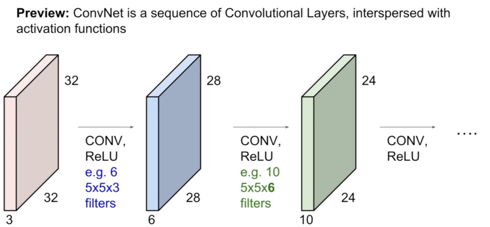
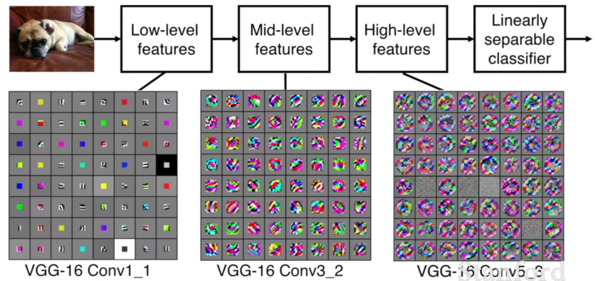
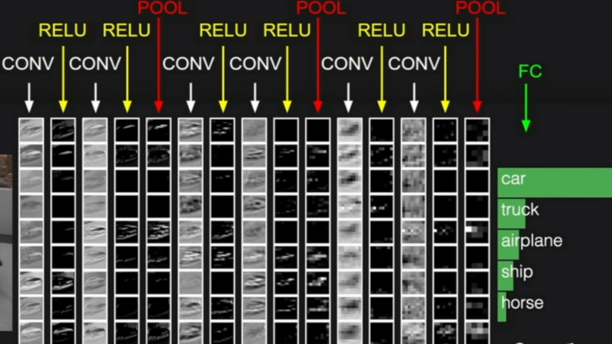
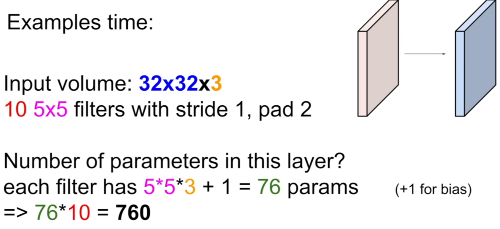

[Convolution: signal processing에서의 convolution 기법을 가져온 것  

  
(({}))  
  
work with multiple filters  
bc each filter is kind of looking for a specific type of concept in the input volume  

  
the filters at the earlier layers usually represent low-level features(edge)  
corner  

depth가 늘어나는 것은 design choice  

edge와 corner가 무시되는 것은 zero padding으로 처리 ➜ 추가로 input 사이즈 유지  
padding 없이는 input 크기가 금방 줄어든다 ➜ 정보를 잃는 것  
one filter ➜ one activation map  
filter == receptive field  

in practice, 필터가 input에 맞게 설정한다  

## Architecture

  

## How to choose filters?

Filter 값이 parameter다  
Filter size(K)는 보통 powers of 2  
  

## Fully connected

Each neuron looks at the full input volume  

## pooling layer

makes the representation smaller and more manageable ➜ downsampling  

# Lecture 6 - Training Neural Networks 1
